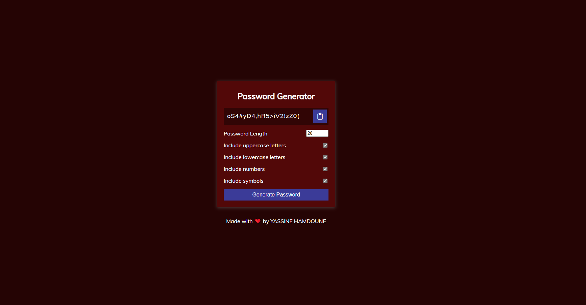

<!-- Title and Description -->
<h1 align="center">
  Password Generator
   
</h1>

  A simple password generator built with Html, Js and Css.

<!-- Screenshots -->
<h2 align="center">Screenshots</h2>

  

<!-- Description and Features -->
<h2 align="center">Description</h2>

A simple password generator that allows users to customize password length and include uppercase letters, lowercase letters, numbers, and symbols. Users can easily generate and copy strong passwords.

<h2 align="center">Features</h2>

  <ul>
    <li>🚀 Customizable password length</li>
    <li>🚀 Option to include uppercase, lowercase letters, numbers, and symbols</li>
    <li>🚀 One-click password generation and copy to clipboard</li>
  </ul>

<!-- Technologies Used -->
<h2 align="center">Technologies Used</h2>

  Html, JavaScript, Css

<!-- Installation Instructions -->
<h2 align="center">Installation</h2>

  To run the app locally, follow these steps:

  <ol>
    <li>Clone the repository:
      <pre><code>https://github.com/yacinova/password-generator.git</code></pre>
    </li>
    <li>Navigate to the project directory:
      <pre><code>cd password-generator</code></pre>
    </li>
    <li>Start the app:  
  Open "<i><b>index.html</b></i>" in your browser.</li>
  </ol>

---

Made with ❤️ by YASSINE HAMDOUNE

  Contact: <a href="mailto:hamdouneyassine.03@gmail.com">hamdouneyassine.03@gmail.com</a>

